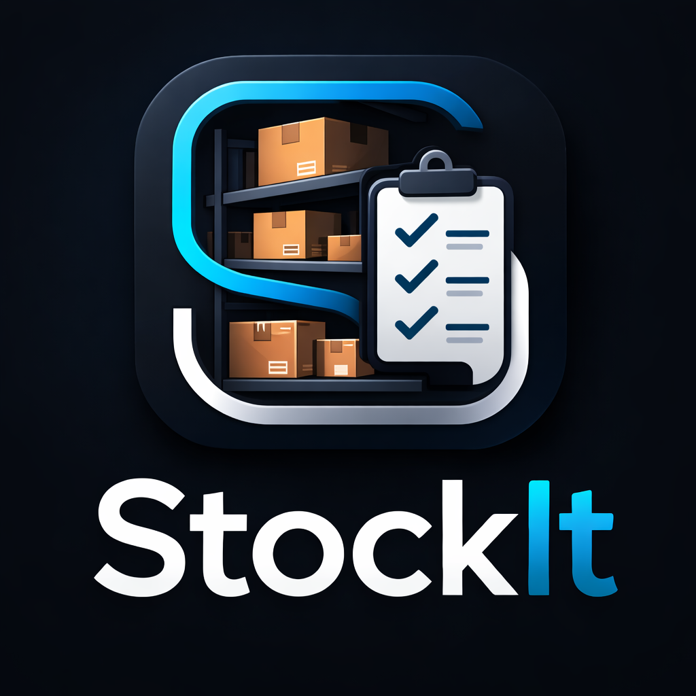

# Stock It - Inventory & Order Management System

**Stock It** is a Django-based web application designed to streamline inventory tracking and automated ordering. It allows businesses to manage stock levels, calculate order quantities based on "Par Levels," and maintain a history of past orders. 

**Deployment Link** - [Stock It App](https://stock-it-app-0249e8108276.herokuapp.com/)

---

## 🚀 Features

### 📦 Inventory Management
*   **Product Tracking:** Add, edit, and delete products with fields for Name, Par Level, and Current Stock.
*   **Scoped Styling:** Custom CSS ensures inventory lists do not conflict with global navigation.

### 📝 Order Management
*   **Order History:** View past orders in a responsive, card-based grid layout grouped by date.
*   **Detailed Reports:** Drill down into specific orders to see exact quantities logged.
*   **Safe Deletion:** Dedicated "Confirm Delete" page to prevent accidental data loss.

### 🔐 User Authentication
*   **Secure Access:** Secure Login/Logout.
*   **Data Privacy:** User-specific data isolation (users only see their own inventory/orders).

---

## 🛠 Tech Stack

*   **Backend:** Python, Django
*   **Database:** SQLite (Local), PostgreSQL (Production/Heroku)
*   **Frontend:** HTML5, CSS3 (Scoped & Modular), Django Templates
*   **Deployment:** Heroku, Gunicorn, WhiteNoise

## 🎯 Stretch Goals

### 📈 Weekly Sales Tracking
*   **Data Integration:** Log weekly sales totals to identify high-volume vs. low-volume periods.
*   **Usage Trends:** Compare actual stock depletion against sales to find hidden waste or "shrinkage."

### 🤖 Intelligent Par Calculation
*   **Dynamic Pars:** Move beyond static numbers. The system will suggest new Par Levels based on a rolling average of previous usage and seasonal sales spikes.
*   **Predictive Ordering:** Forecast inventory needs for the upcoming week before stock actually runs out.

### 💰 Inventory Cost Analysis
*   **Unit Cost Tracking:** Attach purchase prices to each product.
*   **Financial Reporting:** Calculate total "Value of Goods on Hand" and track spending trends over time to optimize the budget.
